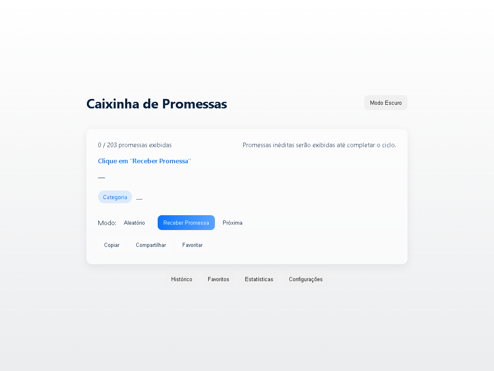
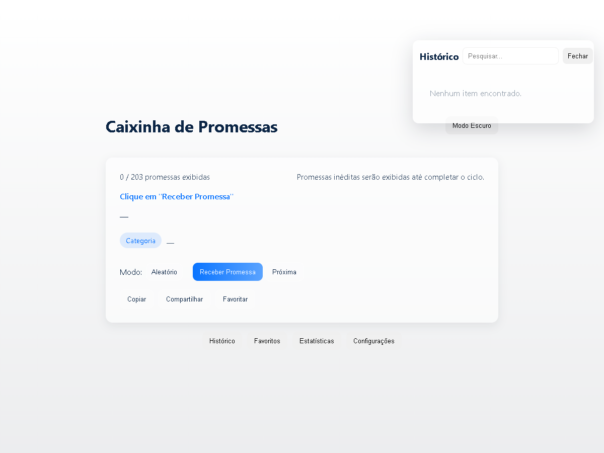
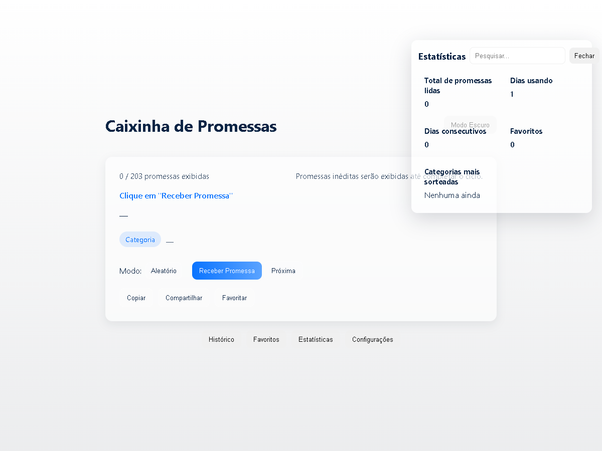

# Caixinha de Promessas

[](https://SEU-PROJETO.vercel.app)
[](LICENSE)
[]

> Aplicativo PWA que entrega promessas bíblicas diárias ou aleatórias. Moderno, responsivo e pensado para portfólio/produto.

🌐 Demonstração Online

https://SEU-PROJETO.vercel.app

📂 Código Fonte

https://github.com/marlonjc35/caixinha-promessas

---

Índice

- Descrição
- Tecnologias
- Arquitetura
- Funcionalidades
- Como executar (local)
- Deploy no Vercel
- Estrutura de pastas
- Melhores práticas e melhorias futuras
- Licença

Descrição

Caixinha de Promessas é um aplicativo web que fornece um versículo bíblico como "promessa" para o dia ou de forma aleatória. Projetado como PWA para permitir instalação em dispositivos móveis, funcionamento offline e experiência similar a um app nativo.

Tecnologias

- HTML5 sem frameworks
- CSS3 moderno (mobile-first, responsivo)
- JavaScript (ES6 modules) puro
- Service Worker (PWA)
- LocalStorage para persistência local

Arquitetura

- Frontend estático — arquivos servidos diretamente (index.html + assets)
- Banco interno (assets/js/database.js) com versículos em JSON
- Módulos JS separados: storage, history, favorites, search, theme, audio, app
- Service Worker para precache e fallback offline

Funcionalidades

- Promessa Aleatória (não repete até completar o ciclo)
- Promessa do Dia (determinística por data, igual para todos)
- Histórico de promessas exibidas (ordenado por data) com pesquisa
- Favoritos (adicionar / remover / pesquisar)
- Painel de Estatísticas (total lido, dias consecutivos, categorias mais sorteadas)
- Tema: Light / Dark com persistência
- Compartilhar e copiar para área de transferência
- PWA: manifest, instalação e funcionamento offline (com fallback)
- Acessibilidade básica: navegação por teclado, foco gerenciado, aria-hidden

Como executar (local)

1. Clone o repositório (ou baixe o ZIP):

   git clone https://github.com/marlonjc35/caixinha-promessas.git

2. Servir localmente (recomendado servidor HTTP simples):
   - Com Python 3:
     ```
     python -m http.server 5000
     ```
   - Ou: use Live Server / http-server / qualquer servidor estático

3. Abrir no navegador:

   http://localhost:5000

Observação: o Service Worker e os módulos ES funcionam corretamente apenas via HTTP(s), não via file://

Deploy no Vercel (guia rápido e deploy automático)

A forma mais simples de publicar este projeto é conectando o repositório ao Vercel (import) — nenhum build step é necessário porque é um site estático. Abaixo há instruções para deploy manual e para configurar deploy automático via GitHub Actions.

Deploy manual (import do GitHub)

1. Criar conta em https://vercel.com e conectar ao GitHub.
2. Importar o repositório (ex.: `marlonjc35/caixinha-promessas`).
3. Selecionar o repositório no painel do Vercel e criar o projeto como "Static Site" — geralmente não há build step.
4. Publicar (Deploy). O Vercel usará arquivos na raiz do repositório.

Deploy automático via GitHub Actions (recomendado)

1. No painel do Vercel, anote/obtenha:
   - Vercel Token (profile > Tokens)
   - Organization ID
   - Project ID
2. No repositório GitHub: Settings > Secrets and variables > Actions > New repository secret. Crie os segredos:
   - VERCEL_TOKEN  (o token obtido acima)
   - VERCEL_ORG_ID
   - VERCEL_PROJECT_ID
3. Este repositório já inclui o workflow em `.github/workflows/vercel-deploy.yml`.
   Ele executa deploy automático em pushes para `main`/`master`.

Notas de segurança e melhores práticas

- Use um token com escopo mínimo para deploys (deploy-only token) e não o exponha em logs.
- O arquivo `.vercelignore` adicionado já protege arquivos que não precisam ser enviados.

Dica: Verifique `manifest.json` e garanta que exista uma versão PNG dos ícones 192x192 e 512x512 para compatibilidade máxima com plataformas e navegadores antigos.

Gerar screenshots para o README/portfólio

Há um script Node (`generate-screenshots.js`) na raiz que usa Puppeteer para capturar as telas principais (home, histórico, estatísticas). Instruções rápidas:

1. Servir o projeto localmente (ex.: `python -m http.server 5000`).
2. Instalar Puppeteer temporariamente:
   - `npm install --no-save puppeteer`
3. Executar:
   - `BASE_URL=http://localhost:5000 node generate-screenshots.js`

Os arquivos gerados serão salvos em `assets/screenshots/`.

Se preferir, use o script PowerShell `deploy-vercel.ps1` na raiz para acionar `npx vercel` localmente (requer node/npm e vercel CLI).

Estrutura das pastas

```
caixinha-promessas/
├─ README.md
├─ LICENSE
├─ index.html
├─ manifest.json
├─ service-worker.js
├─ offline.html
├─ vercel.json
├─ assets/
│  ├─ css/style.css
│  ├─ js/
│  │  ├─ app.js
│  │  ├─ database.js
│  │  ├─ storage.js
│  │  ├─ history.js
│  │  ├─ favorites.js
│  │  ├─ search.js
│  │  ├─ audio.js
│  │  └─ theme.js
│  ├─ icons/
│  │  ├─ icon-192.svg
│  │  ├─ icon-192.png
│  │  ├─ icon-512.svg
│  │  └─ icon-512.png
│  └─ screenshots/
│     ├─ screen-home.png
│     ├─ screen-history.png
│     └─ screen-stats.png
└─ sitemap.xml
```

Screenshots





Melhorias futuras (priorizadas)

1. Gerar PNGs 192/512 para máxima compatibilidade (ferramenta de build ou export manual).
2. Otimizar service worker com estratégias mais avançadas (workbox) e separação de cache por versão.
3. Testes de acessibilidade e contraste (WCAG), adicionar labels ARIA detalhados.
4. Sistema de traduções / escolha de versão da Bíblia (incluir fonte/atenção a direitos autorais).
5. Dashboard de estatísticas visual (gráficos) e export CSV dos favoritos/histórico.
6. Integração com backend (opcional) para sincronizar favoritos e histórico entre dispositivos.

Contribuição

PRs são bem-vindos. Mantenha a lógica em JS puro e siga o padrão de módulos existentes.

Licença

MIT — ver arquivo LICENSE
